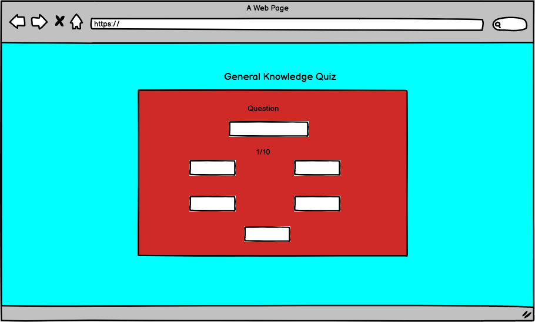
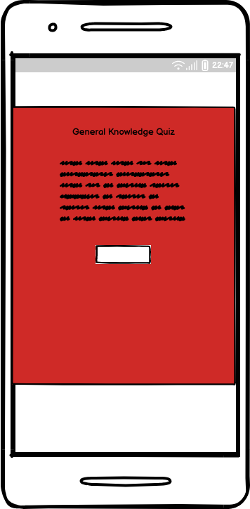

# General Knowledge Quiz

General Knowledge Quiz is a Quiz game, with the aim to test the users general knowledge. The goal of the game is to give the user a funny time while testing their knowledge and it's easy to get started!

Welcome to General Knowledge Quiz: [Quiz](https://fredricho.github.io/Quiz/)

## Wireframes

These wireframes were created in Balsamiq for the General Knwoledge Quiz, one for each page for full-size and mobile size. There will be some adjustments to the final sited due to the development process and time limit.

  
    
   
  

## Site Structure

The General Knowledge Quiz has two pages, [Home](/index.html), [Quiz](/quiz.html), The Quiz is entered thru a button "Start Quiz" which starts the quiz, and quiz page has a button "Stop Quiz" that takes the user back to home page.

## Design Choiches
  * ### Typography

  The chosen fonts for this website were Merriweather for headings and Bitter for the body and the backup fonts were sans-serif respectively.
  * Merriweather was choosen to be a good looking font and easy to read.
  * Bitter was chosen to be easy to read. 

* ### Color Scheme

The chosen color scheme for the site/quiz is to give the site a good looking style.

## Features
The Quiz is developed to be simple, and the focus is to let the user started with the quiz directly.

## Existing Features

  * ### Home- First Page
    * Is the first page the users enters, it has a short descritption and rules of the quiz game. The start button on the page navigates the user to the quiz and starts it. 

    

  * ### Quiz - Page
    * Is were the Quiz is located, and it views the question and four alternatives to each question. If the users choice is correct the button border, text and font-size will change to red/green and the font-size will get bigger or smaller. The number of questions and the users score is to be viewed aswell. 
      

 

## Future Features
* A highscore page.
* Different Quiz themes

## Technologies Used
* HTML5 - Provides the structure for the site. 
* CSS - Provides the styling for the site.
* JavaScript - Provides the interactivity for the site.
* Balsamiq - Used to sketch the page. 
* Gitpod - Used to deploy the site. 
* Github - Used to host the site and make edits. 

## Testing 

### Code Validation

The site has gone through several tests to minimize the risk of unwanted errors. All pages have been validated in W3C html Validator,the W3C CSS Validator and JShint for JavaScript. There were a few minor errors, such as no !DOCTYPE, unused variables after the test all of the errors, were fixed. I first placed a href in button, which generated a warning, styled the A-tag as a button instead. Images of the result in HTML validator, for each page:

* ### Home Page

* ### Quiz Page

 
 ### CSS Validator Results

### JSHint Result

## Responsiveness Test
* This test was made manually tested with Google Chrome Devtools, and all of the listed devices in devtools were checked. Both pages passed the test.

   

## Browser Compatibility
* The General Knowledge Page site is tested on four different browsers: 
Google Chrome - Pass, no visible errors or bugs, and fully responsive.
Apple Safari - Pass, no visible errors or bugs, and fully responsive.
Microsoft Edge - Pass, no visible errors or bugs, and fully responsive.
Mozilla Firefox - Pass, no visible errors or bugs, and fully responsive.

 ## Known Bugs
 * Resolved
   * During the HTML validation a few bugs were shown:
     * No !DOCTYPE HTML, a tag in button tag. 
     * Unused variables variables in JS.
     * 18 warinngs in JS 	'const' is available in ES6 (use 'esversion: 6') or Mozilla JS extensions (use moz).
     * a href in a button tag.
     * duplicate classes on a div.

* Unresolved
 * The question counter counts after being clicked, when Q 2 i viewed it's still Q1 before it's clicked.
 

## Additional Testing 

### Lighthouse
  * The site is tested with Google Chrome Lighthouse, the results are shown in the image below:
  
 

   ## Deployment
 The site was deployed on Github and how it was made and an image:
 1. GitHub > Repository > Settings Tab
 2. Go to Pages
 3. Source > select Branch to master > Save
 4. Wait some time, then a link will appear up if the progress were successful.

 

 [Link to repository](https://github.com/Fredricho/Quiz)

  
  ## To fork the repository on GitHub

A copy of the repository can be made and changes to the copy won't affect the original repository. Below are the steps to fork it:

1. Login in and go to [Link to repository](https://github.com/Fredricho/Quiz)
2. The fork icon is top right, click that button to make a copy of the original repository.

## Create a local clone of this project

Here comes a guide to creating a local clone of this project:

1. Go to repository
2. Press code - button 
3. Click the copy button. 
4. In the wanted IDE, Open Git Bush. 
5. Change the current working directory to the location you prefer to get it cloned to. 
6. Type git clone and CTRL-V/Paste the URL from the previous step from Github 
7. Hit enter and a clone will be created.

## Credits
* GitHub- For make it possible to host my site.
* Gitpod - For giving me the nessecary tools to develop a site. 
* ChatGpt - For generated Quiz questions and answers.
* Balsamiq - For the wireframes.
* W3schools - For all of the information, was really key for making this site.
* YouTube toutorial: Brian Design How to Make a Quiz App using HTML CSS Javascript
* YouTube toutorial: Code Geek Create a Quiz App using HTML, CSS & JavaScript
* YouTube toutorial: Keep Coding QUIZ with JavaScript | The Ultimate Guide

## Content
The Quiz is generated by ChatGpt. Icons in Home and Quiz page were taken from FontAwesome. 

## Acknowledgements
This site was made as my second project at Code Institute, it is my first game to develop as well and the first time using JavaScript. I had no mentor sessions on this project, cause my assigned mentor had no aviable time unfortunately. So I had to rely on youtube tutorials, slack and google to get some advices. 

Fredricho 2023